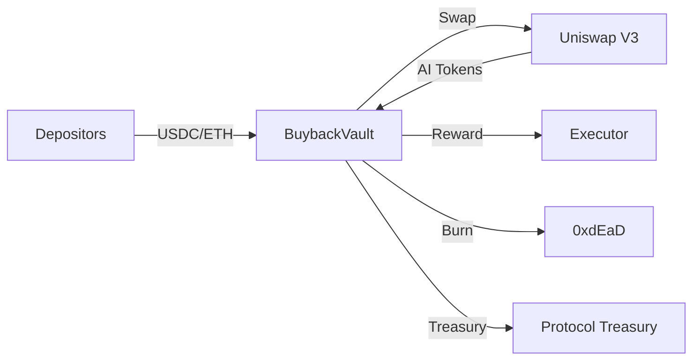

# Gensyn Buyback Vault

A smart contract system for automated token buybacks on Uniswap V3, designed for the Gensyn protocol.

## Overview

The **BuybackVault** accepts deposits of approved ERC20 tokens or native ETH, swaps them for the protocol's AI token via Uniswap V3, and distributes the acquired tokens according to configurable split ratios:

- **Executor Reward**: Incentive for the address triggering the buyback
- **Burn**: Sent to dead address (0xdEaD) for deflationary pressure  
- **Treasury**: Protocol treasury for ecosystem development



## Features

- **Multi-token Support**: Accept any approved ERC20 or native ETH
- **TWAP Protection**: Slippage protection using Uniswap V3 TWAP oracles
- **Epoch Volume Limits**: Per-token volume caps that reset each epoch
- **Upgradeable**: UUPS proxy pattern for future improvements
- **Pausable**: Emergency pause capability
- **Access Control**: Ownable2Step for secure ownership transfer

## Documentation

- [Design Document](./docs/DESIGN.md) - Architecture, flows, and technical details
- [Deployment Document](./docs/DEPLOYMENT.md) - Deployment guide for Testnet and Mainnet
- [Setup & Configuration Guide](./docs/SETUP.md) - Guide for smart contracts setup and configuration

## Quick Start

### Prerequisites

- [Foundry](https://book.getfoundry.sh/getting-started/installation)

### Build

```shell
forge build
```

### Test

```shell
forge test
```

### Test with Verbosity

```shell
forge test -vvv
```

### Gas Report

```shell
forge test --gas-report
```

### Format

```shell
forge fmt
```

## Configuration

### Initialization Parameters

| Parameter | Description | Example |
|-----------|-------------|---------|
| `aiToken` | Target token to acquire | AI token address |
| `treasury` | Treasury recipient | Multisig address |
| `swapRouter` | Uniswap V3 SwapRouter | swap Router Address |
| `burnBps` | Burn percentage (basis points) | `7000` (70%) |
| `executorRewardBps` | Executor reward (basis points) | `100` (1%) |
| `twapWindow` | TWAP observation window | `1800` (30 min) |
| `maxSlippageBps` | Max slippage from TWAP | `100` (1%) |
| `epochDuration` | Volume limit epoch duration | `86400` (1 day) |


## Development

### Project Structure

```
├── src/
│   ├── BuybackVault.sol      # Main contract
│   └── interfaces/
│       ├── IBuybackVault.sol # Interface
│       └── external/
│           └── IWETH.sol     # WETH interface
├── test/
│   ├── BuybackVault.t.sol          # Unit tests
│   └── BuybackVaultInvariant.t.sol # Fuzz & invariant tests
├── docs/
│   └── DESIGN.md             # Design documentation
└── script/                   # Deployment scripts
```

### Running Invariant Tests

```shell
forge test --match-contract Invariant
```

### Coverage

```shell
forge coverage
```
