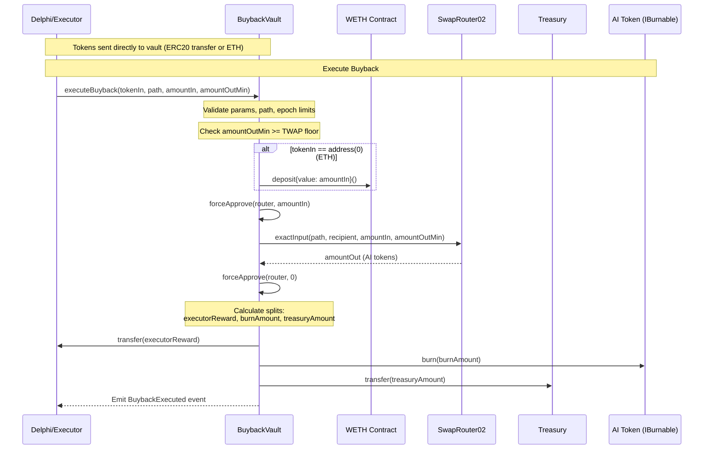
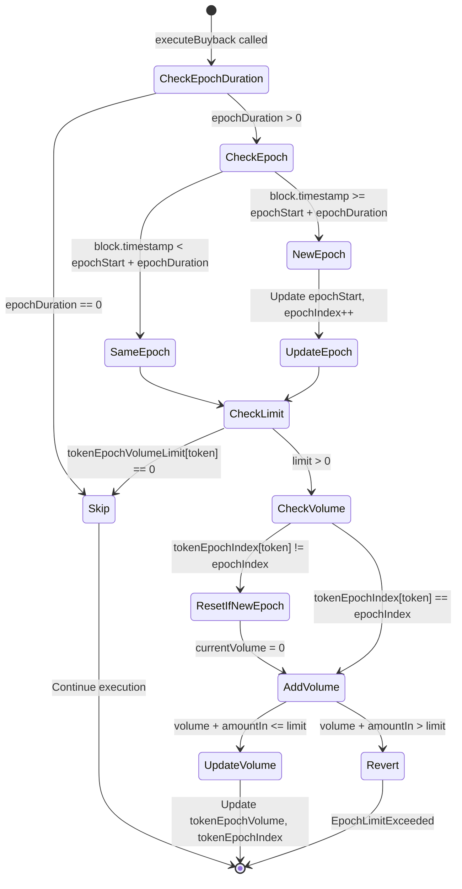
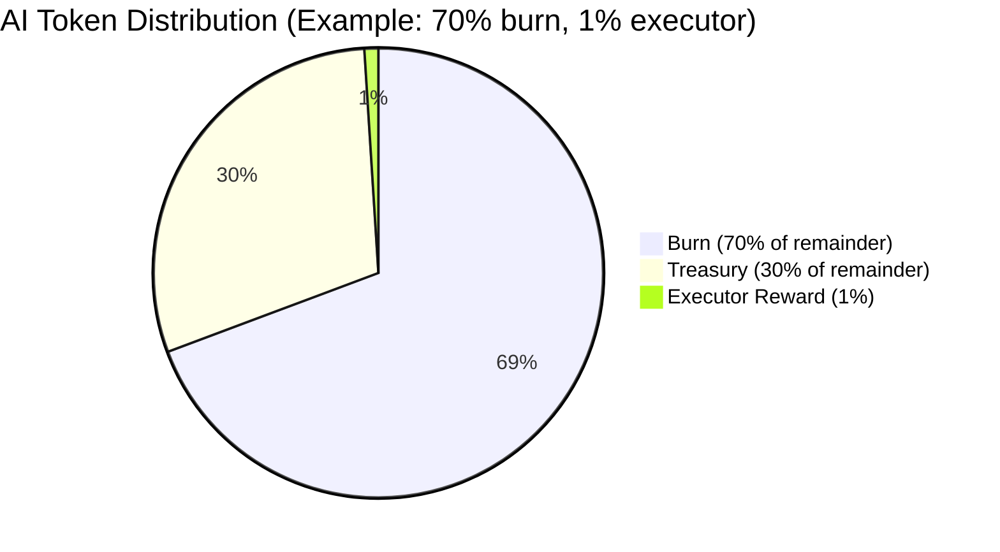
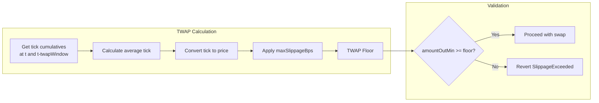
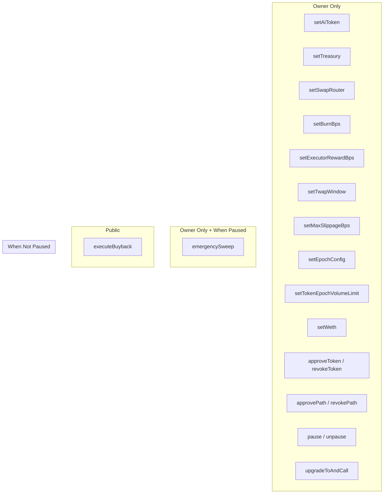
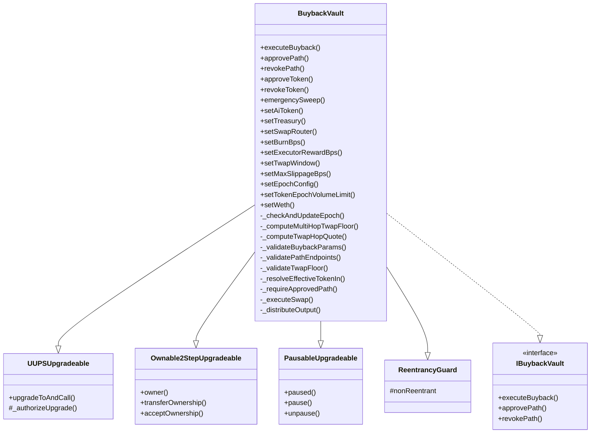

# BuybackVault Design Document

## Overview

The **BuybackVault** is an upgradeable smart contract that manages automated token buybacks for the Gensyn protocol. It holds approved tokens (ERC20 or native ETH) received directly, swaps them for the protocol's AI token via Uniswap V3, and distributes the acquired tokens according to configurable split ratios.

## Architecture

## Core Components

### State Variables

| Variable            | Type      | Description                                      |
| ------------------- | --------- | ------------------------------------------------ |
| `aiToken`           | `address` | Target token to acquire via buybacks             |
| `treasury`          | `address` | Recipient of treasury portion                    |
| `swapRouter`        | `address` | Uniswap V3 SwapRouter02 address                  |
| `weth`              | `address` | WETH contract for ETH handling                   |
| `burnBps`           | `uint16`  | Basis points for burn (of post-executor amount)  |
| `executorRewardBps` | `uint16`  | Basis points for executor reward                 |
| `twapWindow`        | `uint32`  | TWAP observation window in seconds               |
| `maxSlippageBps`    | `uint16`  | Maximum allowed slippage from TWAP               |
| `epochDuration`     | `uint32`  | Duration of volume limit epochs                  |
| `epochStart`        | `uint32`  | Timestamp of current epoch start                 |
| `epochIndex`        | `uint32`  | Current epoch index (incremented on epoch reset) |

### Mappings

| Mapping                 | Description                                                               |
| ----------------------- | ------------------------------------------------------------------------- |
| `approvedTokens`        | Whitelist of tokens that can be swapped                                   |
| `approvedPaths`         | Whitelist of Uniswap V3 swap paths (keyed by `keccak256(path)`)           |
| `pathPools`             | Pool addresses for TWAP calculation per path (keyed by `keccak256(path)`) |
| `tokenEpochVolumeLimit` | Per-token volume limit per epoch                                          |
| `tokenEpochVolume`      | Current epoch volume consumed per token                                   |
| `tokenEpochIndex`       | Epoch index when token volume was last updated                            |

## Additional Flow Details

### Receiving Funds

The vault receives funds directly without dedicated deposit functions:

- **ERC20 tokens**: Sent via standard `transfer()` to the vault address
- **Native ETH**: Sent directly to the vault (handled by `receive()` function)

### Epoch Volume Management

## Token Distribution

The distribution formula:

1. **Executor Reward**: `amountOut * executorRewardBps / 10000`
2. **Burn Amount**: `(amountOut - executorReward) * burnBps / 10000`
3. **Treasury Amount**: `amountOut - executorReward - burnAmount`

## TWAP Slippage Protection

For multi-hop swaps, the TWAP floor is computed by chaining quotes through each pool in the path.

## Access Control

## Security Features

### Reentrancy Protection

- `executeBuyback` uses OpenZeppelin's `ReentrancyGuard` (`nonReentrant` modifier)

### Pausability

- Owner can pause/unpause the contract
- `executeBuyback` is blocked when paused
- `emergencySweep` only available when paused (allows recovery)

### Upgradeability

- UUPS proxy pattern with `Ownable2Step` for safe ownership transfer
- Storage gap (`__gap[41]`) for future upgrades

### Input Validation

- All addresses validated against zero address
- BPS values validated to not exceed 10,000 (combined `burnBps + executorRewardBps`)
- Path structure validated for Uniswap V3 format (minimum 43 bytes, `(length - 20) % 23 == 0`)
- Amounts validated against overflow (uint128 max)
- Pool addresses are derived from the Uniswap V3 factory (`IUniswapV3Factory.getPool`) on each `approvePath` call — owners cannot supply arbitrary pool addresses
- WETH address validated as contract (not EOA) when set

## Contract Inheritance

## Events

### Core Events

| Event             | Parameters                                                               | Description                                                    |
| ----------------- | ------------------------------------------------------------------------ | -------------------------------------------------------------- |
| `BuybackExecuted` | tokenIn, amountIn, amountOut, executorReward, burnAmount, treasuryAmount | Emitted on successful buyback                                  |
| `PathApproved`    | path, derivedPools                                                       | Emitted when a swap path is approved (includes factory-derived pool addresses) |
| `PathRevoked`     | path                                                                     | Emitted when a swap path is revoked                            |
| `TokenApproved`   | token                                                                    | Emitted when a token is approved                               |
| `TokenRevoked`    | token                                                                    | Emitted when a token is revoked                                |
| `EmergencySwept`  | token, to, amount                                                        | Emitted when funds are swept during emergency                  |

### Configuration Update Events

| Event                          | Parameters               | Description                                          |
| ------------------------------ | ------------------------ | ---------------------------------------------------- |
| `AiTokenUpdated`               | oldToken, newToken       | Emitted when AI token address is changed             |
| `TreasuryUpdated`              | oldTreasury, newTreasury | Emitted when treasury address is changed             |
| `SwapRouterUpdated`            | oldRouter, newRouter     | Emitted when swap router address is changed          |
| `BurnBpsUpdated`               | oldBps, newBps           | Emitted when burn basis points is changed            |
| `ExecutorRewardBpsUpdated`     | oldBps, newBps           | Emitted when executor reward basis points is changed |
| `TwapWindowUpdated`            | oldWindow, newWindow     | Emitted when TWAP window is changed                  |
| `MaxSlippageBpsUpdated`        | oldBps, newBps           | Emitted when max slippage basis points is changed    |
| `EpochConfigUpdated`           | duration                 | Emitted when epoch duration is changed               |
| `TokenEpochVolumeLimitUpdated` | token, newLimit          | Emitted when token epoch volume limit is changed     |
| `WethUpdated`                  | oldWeth, newWeth         | Emitted when WETH address is changed                 |

## Error Codes

| Error                   | Condition                                      |
| ----------------------- | ---------------------------------------------- |
| `ZeroAddress`           | Address parameter is zero                      |
| `BpsOverflow`           | BPS values sum exceeds 10,000                  |
| `TwapWindowTooShort`    | TWAP window < 1800 seconds                     |
| `SlippageTooHigh`       | Max slippage > 500 bps (5%)                    |
| `EpochDurationOverflow` | Epoch duration exceeds uint32 max              |
| `TokenNotApproved`      | Token not in whitelist                         |
| `ZeroAmount`            | Amount parameter is zero                       |
| `AmountTooLarge`        | Amount exceeds uint128 max                     |
| `InvalidPath`           | Path structure invalid for Uniswap V3          |
| `WethNotConfigured`     | ETH swap attempted without WETH set            |
| `TokenInMismatch`       | Path first token doesn't match tokenIn         |
| `InvalidPathOutput`     | Path last token doesn't match aiToken          |
| `PathNotApproved`       | Swap path not approved                         |
| `SlippageExceeded`      | amountOutMin below TWAP floor                  |
| `PoolNotFound`          | Factory returned zero address for a path hop               |
| `EpochLimitExceeded`    | Volume limit reached for epoch                             |
| `EthTransferFailed`     | Native ETH transfer failed                     |
| `NotAContract`          | Address has no code (used for WETH validation) |
