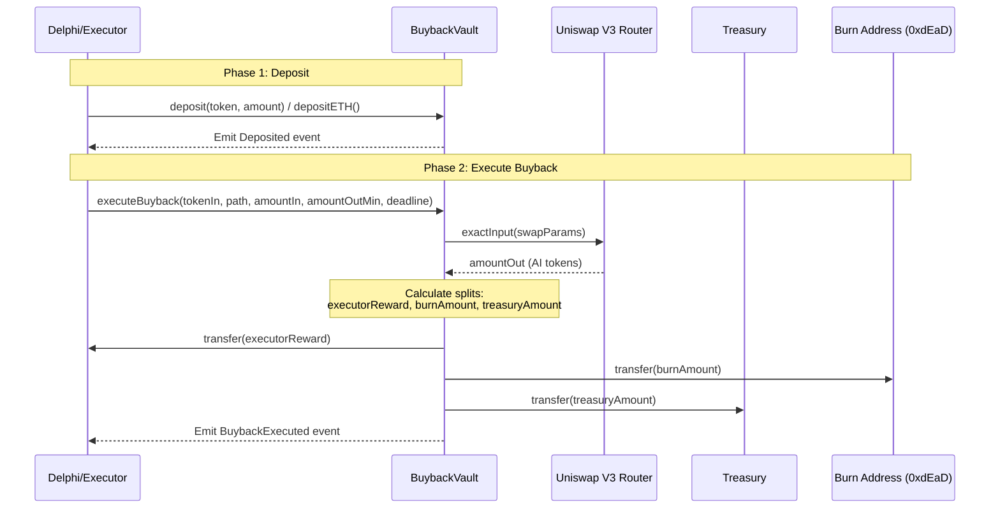
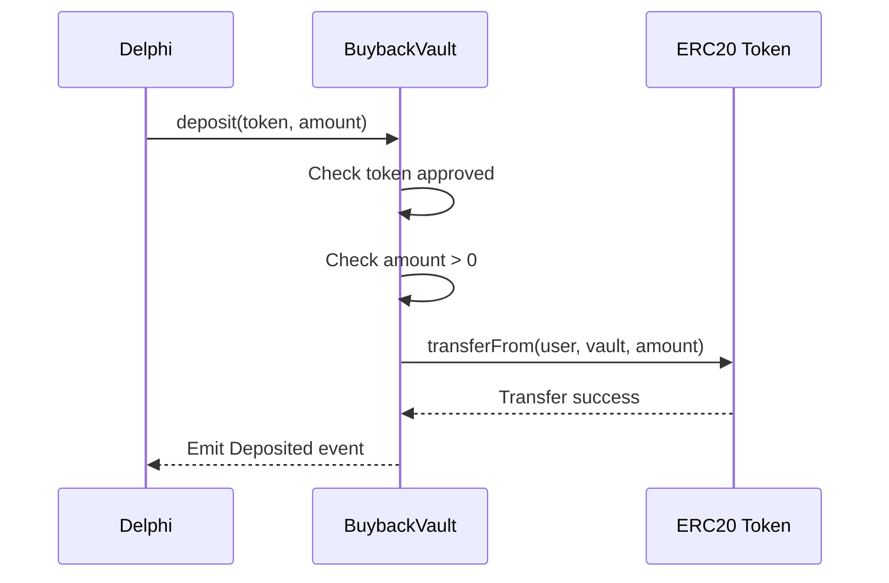
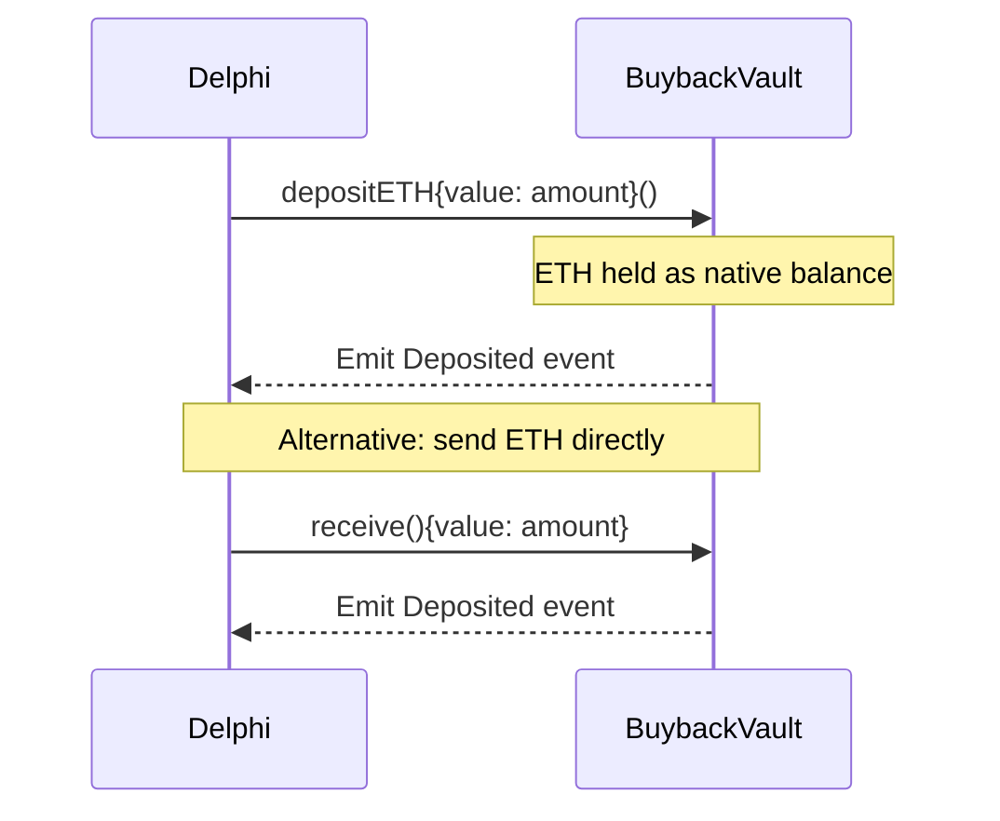
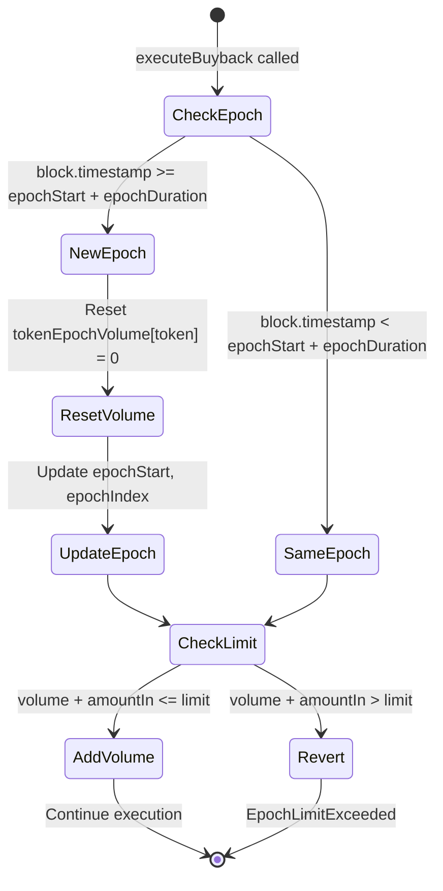
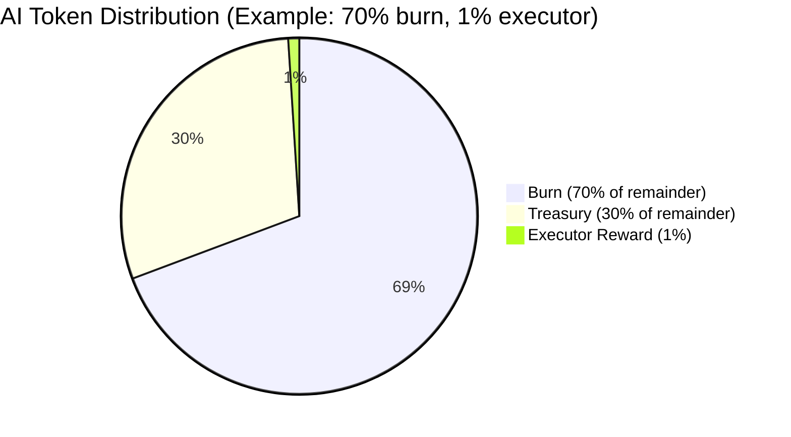
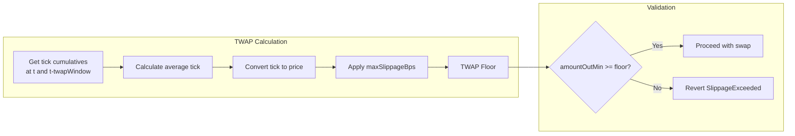
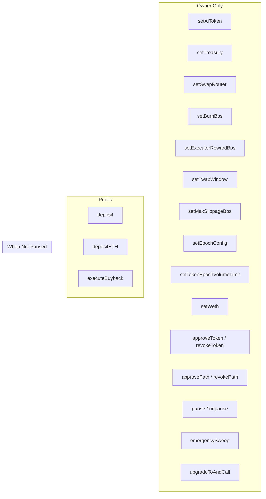
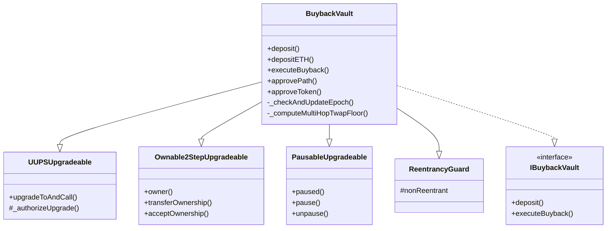

# BuybackVault Design Document

## Overview

The **BuybackVault** is an upgradeable smart contract that manages automated token buybacks for the Gensyn protocol. It accepts deposits of approved tokens (ERC20 or native ETH), swaps them for the protocol's AI token via Uniswap V3, and distributes the acquired tokens according to configurable split ratios.

## Architecture

## Core Components

### State Variables

| Variable | Type | Description |
|----------|------|-------------|
| `aiToken` | `address` | Target token to acquire via buybacks |
| `treasury` | `address` | Recipient of treasury portion |
| `swapRouter` | `address` | Uniswap V3 SwapRouter address |
| `weth` | `address` | WETH contract for ETH handling |
| `burnBps` | `uint16` | Basis points for burn (of post-executor amount) |
| `executorRewardBps` | `uint16` | Basis points for executor reward |
| `twapWindow` | `uint32` | TWAP observation window in seconds |
| `maxSlippageBps` | `uint16` | Maximum allowed slippage from TWAP |
| `epochDuration` | `uint32` | Duration of volume limit epochs |
| `epochStart` | `uint32` | Timestamp of current epoch start |

### Mappings

| Mapping | Description |
|---------|-------------|
| `approvedTokens` | Whitelist of tokens that can be deposited/swapped |
| `approvedPaths` | Whitelist of Uniswap V3 swap paths |
| `pathPools` | Pool addresses for TWAP calculation per path |
| `tokenEpochVolumeLimit` | Per-token volume limit per epoch |
| `tokenEpochVolume` | Current epoch volume consumed per token |

## Additional Flow Details

### ERC20 Deposit Flow

### ETH Deposit Flow

### Epoch Volume Management

## Token Distribution

The distribution formula:
1. **Executor Reward**: `amountOut * executorRewardBps / 10000`
2. **Burn Amount**: `(amountOut - executorReward) * burnBps / 10000`
3. **Treasury Amount**: `amountOut - executorReward - burnAmount`

## TWAP Slippage Protection

For multi-hop swaps, the TWAP floor is computed by chaining quotes through each pool in the path.

## Access Control

## Security Features

### Reentrancy Protection
- `executeBuyback` uses OpenZeppelin's `ReentrancyGuard` (`nonReentrant` modifier)

### Pausability
- Owner can pause/unpause the contract
- `executeBuyback` is blocked when paused
- Deposits remain available (allows recovery)

### Upgradeability
- UUPS proxy pattern with `Ownable2Step` for safe ownership transfer
- Storage gap (`__gap[41]`) for future upgrades

### Input Validation
- All addresses validated against zero address
- BPS values validated to not exceed 10,000
- Path structure validated for Uniswap V3 format
- Amounts validated against overflow (uint128 max)

## Contract Inheritance

## Events

| Event | Parameters | Description |
|-------|------------|-------------|
| `Deposited` | token, depositor, amount | Emitted on successful deposit |
| `BuybackExecuted` | tokenIn, amountIn, amountOut, executorReward, burnAmount, treasuryAmount | Emitted on successful buyback |
| `PathApproved` | pathHash | Emitted when a swap path is approved |
| `PathRevoked` | pathHash | Emitted when a swap path is revoked |
| `TokenApproved` | token | Emitted when a token is approved |
| `TokenRevoked` | token | Emitted when a token is revoked |

## Error Codes

| Error | Condition |
|-------|-----------|
| `ZeroAddress` | Address parameter is zero |
| `BpsOverflow` | BPS values sum exceeds 10,000 |
| `TwapWindowTooShort` | TWAP window < 1800 seconds |
| `SlippageTooHigh` | Max slippage > 500 bps (5%) |
| `TokenNotApproved` | Token not in whitelist |
| `PathNotApproved` | Swap path not approved |
| `DeadlineExpired` | Transaction deadline passed |
| `SlippageExceeded` | amountOutMin below TWAP floor |
| `EpochLimitExceeded` | Volume limit reached for epoch |
| `WethNotConfigured` | ETH swap attempted without WETH set |
